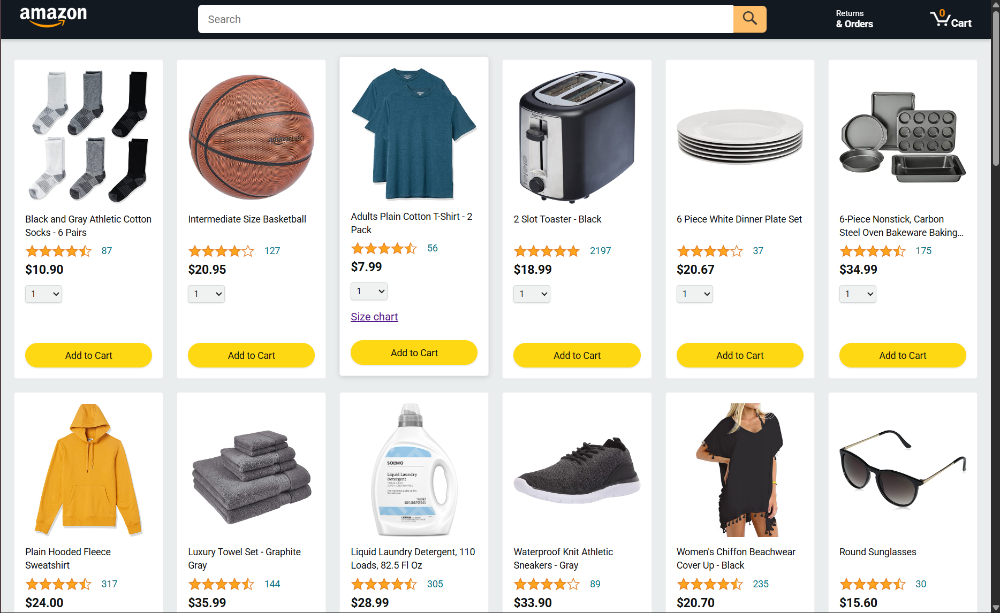
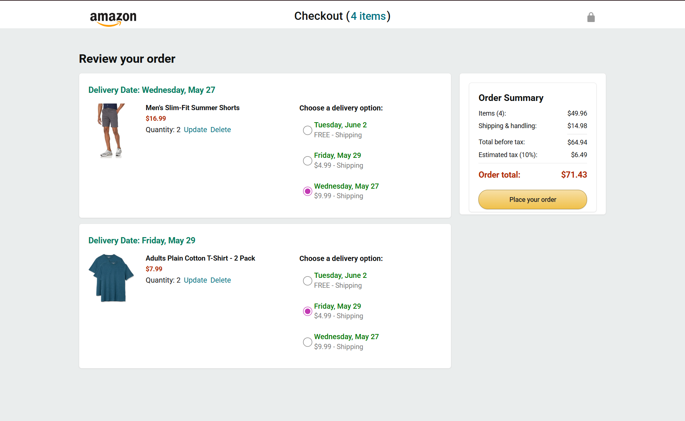
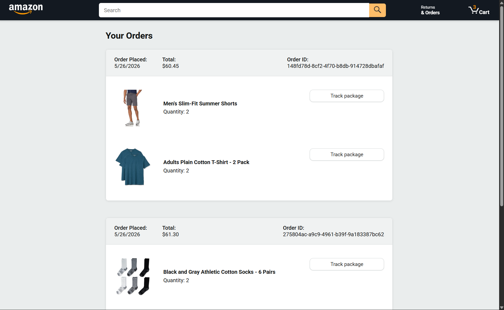
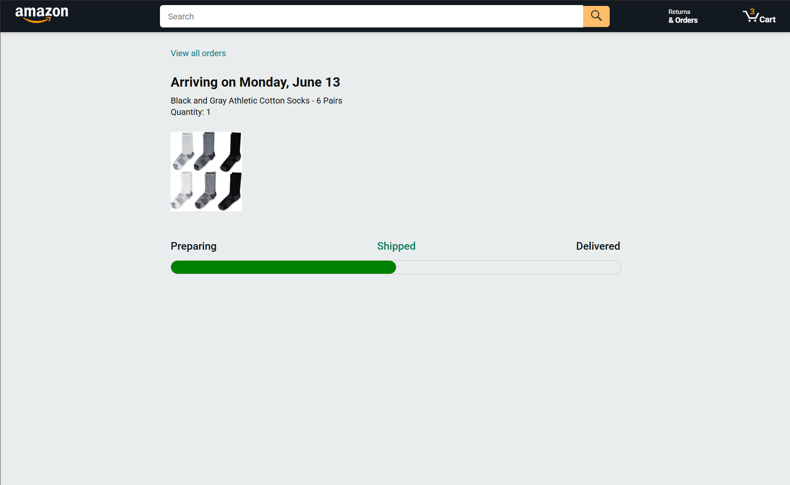

# 🛒 Amazon Vanilla JS Project
 

A fully responsive Amazon-inspired eCommerce web application built using **Vanilla JavaScript (ES6 Modules), HTML5, and CSS3**.

This project replicates real-world eCommerce functionality such as product browsing, cart management, checkout flow, order placement, and delivery selection. It focuses heavily on modular architecture, OOP design principles, asynchronous programming, and automated testing with Jasmine.

---

## 🎬 Demo Preview (Click to view)


---

## 📸 Screenshots

### 🏠 Home Page


### 🛒 Checkout Page


### 📦 Orders Page


### 🚚 Tracking Page


---

## 🚀 Features

- 🛍️ Dynamic Product Listing  
- 🛒 Add to Cart System  
- 🔄 Update Cart Quantity  
- ❌ Remove Items from Cart  
- 🚚 Multiple Delivery Options  
- 💳 Real-time Checkout Calculation  
- 📦 Order Placement System (API integrated)  
- 🧾 Order History Page  
- 💾 LocalStorage Persistence  
- ⚡ Modular ES6 Architecture  
- 🧱 OOP-based Product System  
- 🔌 Fetch API + Async/Await  
- 🧪 Automated Testing with Jasmine  
- 📱 Fully Responsive UI  

---

## 🧠 Tech Stack

### Frontend
- HTML5  
- CSS3  
- Vanilla JavaScript (ES6 Modules)

### APIs & Storage
- Fetch API  
- LocalStorage  
- SessionStorage  

### Testing
- Jasmine Testing Framework  

### Utilities
- Day.js (date handling)

---

## 📂 Project Structure

```
amazon-clone/

├── amazon.html
├── checkout.html
├── orders.html
├── tracking.html
│
├── data/
│   ├── cart.js
│   ├── products.js
│   ├── delivery.js
│   ├── orders.js
│
├── scripts/
│   ├── amazon.js
│   ├── checkout.js
│   │
│   ├── checkout/
│   │   ├── checkoutHeader.js
│   │   ├── orderSummary.js
│   │   ├── paymentSummary.js
│   │
│   ├── utils/
│   │   ├── money.js
│
├── styles/
│   ├── shared/
│   ├── pages/
│
├── images/
│
├── assets/
│   ├── demo.mp4
│   ├── main.png
│   ├── checkout.png
│   ├── order.png
│   ├── tracking.png
│
└── tests/
    └── jasmine/
```

## 🧩 Pages Overview

### 🏠 Home Page
- Displays all products dynamically  
- Ratings & pricing system  
- Quantity selector  
- Add-to-cart functionality  

### 🛒 Checkout Page
- Cart item management  
- Update / delete products  
- Delivery option selection  
- Live price calculation  
- Tax & total summary  

### 📦 Orders Page
- Displays placed orders  
- Order grouping system  
- “Track Package” button integration  

### 🚚 Tracking Page
- Order shipment tracking UI  

⚠️ Tracking system is planned for full live progress updates in future improvements.

---

## ⚙️ Key JavaScript Concepts Used

- ES6 Modules  
- OOP (Classes, Encapsulation, Inheritance)  
- DOM Manipulation  
- Event Delegation  
- Async/Await  
- Fetch API  
- Array Methods (map, forEach, filter)  
- LocalStorage / SessionStorage  
- Template Literals  
- Destructuring  
- Modular Architecture  

---

## 🧱 Architecture Highlights

### Cart System
- Central cart state management  
- Quantity updates  
- Persistent storage sync  

### Order System
- Prevents duplicate order creation  
- Stores order history in localStorage  
- Integrates backend API response  

### Checkout Flow
- Fully dynamic UI rendering  
- Real-time price updates  
- Delivery option handling  

---
## 💾 Features

- Cart persists after refresh  
- Orders saved permanently  
- Session-based tracking support  

---

## 🧪 Testing (Jasmine)

Automated tests ensure correctness of core logic:

### Covered Areas
- Cart functionality  
- Quantity updates  
- Price calculations  
- Delivery selection  
- UI rendering logic  

---

## 📱 Responsive Design

Optimized for:

- 💻 Desktop  
- 📱 Mobile  
- 📟 Tablets  

### Includes:
- Responsive grid system  
- Adaptive checkout layout  
- Mobile-friendly navigation  

---

## 📌 Status

✔️ Core eCommerce system complete  
✔️ Checkout flow complete  
✔️ Orders system complete  
🚧 Tracking page (in progress improvements)  

---

## 🙏 Credits

This project was built while learning from [@SuperSimpleDev](https://www.youtube.com/@supersimpledev).

- Starter code structure inspired by lessons from [@SuperSimpleDev](https://www.youtube.com/@supersimpledev)
- Core JavaScript concepts learned through his tutorials  
- Project extended and customized independently  

---

## 👨‍💻 Author

This project is created by **Adarsh Ranjan** as a learning-focused implementation to explore how modern web applications replicate real-world e-commerce platforms using vanilla JavaScript, HTML, and CSS.

It is designed to demonstrate how core shopping features—such as product listings, cart management, checkout flow, order tracking, and data persistence—can be structured in a modular and maintainable way.

The project also serves as a sandbox for experimenting with scalable front-end architecture, where data modules, UI components, and utility functions are separated for clarity and reuse.

If you use or extend this project, you are encouraged to adapt it to your own workflow—whether that means integrating APIs, improving state management, or enhancing the UI/UX experience.

Contributions, improvements, and new ideas are always welcome.

Github: [adarsh-aur](https://github.com/adarsh-aur)

Built with ❤️ in India.